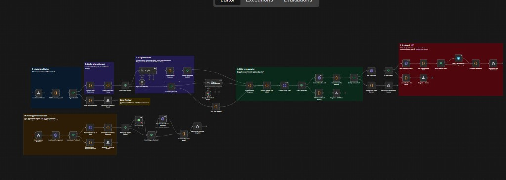
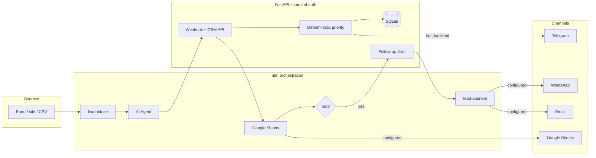

<p align="center">
  
  
  
  
  
  
</p>

<h1 align="center">AI Sales & CRM Automation</h1>

<p align="center">
  <b>Inbound lead → AI qualification → CRM → Google Sheets → human approval → optional Telegram / WhatsApp / email</b><br>
  A portfolio-grade sales automation platform: n8n orchestrates, FastAPI is the source of truth, and nothing is sent to a customer until a human says yes.
</p>

<p align="center">
  <a href="#what-it-does">Capabilities</a> ·
  <a href="#n8n-workflow">Workflow</a> ·
  <a href="#architecture">Architecture</a> ·
  <a href="#potential">Potential</a> ·
  <a href="#quick-start">Quick start</a> ·
  <a href="#demo">Demo</a>
</p>

---

<p align="center"><i>ورود لید، امتیازدهی با AI، ثبت در CRM، و ارسال پیام فقط بعد از تأیید انسان — برای دمو و پورتفولیو، نه CRM تولیدی.</i></p>

## What it does

Unstructured inbound leads waste sales time. This system automates the slice that *should* be automated, and **stops** where a human must stay in the loop.

| Stage | What happens |
|-------|----------------|
| **Capture** | Webhook intake from a form, site, or batch file |
| **Validate** | Bad payloads never reach CRM |
| **Enrich** | Local domain / seniority hints (no fake Clearbit) |
| **Pre-qualify** | n8n **AI Agent** + official **Groq Chat Model** (`llama-3.1-8b-instant`) |
| **Persist** | FastAPI + SQLite, insert-first idempotency on `external_id` |
| **Score** | Backend LLM (or honest mock) + **deterministic** priority rules |
| **Route** | Hot vs warm vs cold |
| **Export** | Official n8n Google Sheets upsert (and optional backend snapshot) |
| **Draft** | Follow-up copy stored as `awaiting_approval` |
| **Approve** | Human webhook / API — then mock send, optional WhatsApp & email |

The model classifies and writes prose. **Code** owns validation, persistence, priority thresholds, webhook auth, and the send gate.

## n8n workflow

Official n8n nodes — **AI Agent**, **Groq Chat Model**, **Telegram**, **WhatsApp**, **Google Sheets** — plus HTTP only where there is no first-party node (FastAPI CRM, Resend).

<p align="center">
  
</p>

<p align="center"><sub>Color groups: intake → enrichment → AI Agent → CRM → Google Sheets → hot routing / HITL. Bottom row is human approval + WhatsApp / email.</sub></p>

| Lane | Nodes | Behavior |
|------|--------|----------|
| **1. Intake** | Webhook → Validate → IF | Reject missing name / email / company / message |
| **2. Enrichment** | Code | Email domain, guessed site, seniority — local only |
| **3. AI qualification** | AI Agent + Groq Chat Model | Structured JSON; skip honestly if `GROQ_API_KEY` / credential is missing |
| **4. CRM** | HTTP → FastAPI | Create lead, `/qualify`, read-back. Backend priority wins |
| **4b. Sheets** | Official Create sheet + Append or update row | Upsert qualified lead by `id`; skip if spreadsheet id is empty |
| **5. Routing & HITL** | IF hot → draft → official Telegram alert | Customer copy is **not** sent here |
| **Approve** | Second webhook | `approve-followup` → optional official WhatsApp + Resend email |

## Architecture



| Layer | Owns | Does not own |
|-------|------|----------------|
| **n8n** | Visual flow, validation, AI Agent pre-qualify, Sheets upsert, channel adapters, HITL webhook | Stored priority, SQLite writes |
| **FastAPI** | CRM, deterministic scoring, HITL flag, backend Telegram on `/qualify` | Canvas orchestration |
| **LLM** | Intent, fit, pain points, summary, draft text | DB writes, sending messages, picking URLs |

More detail: [docs/ARCHITECTURE.md](docs/ARCHITECTURE.md) · [docs/DECISIONS.md](docs/DECISIONS.md) · راهنمای فارسی: [docs/HOW_IT_WORKS_FA.md](docs/HOW_IT_WORKS_FA.md)

## Capabilities

**Sales automation**
- Hot / warm / cold routing from backend rules (not “whatever the model said”)
- Follow-up draft generated, **blocked until human approval**
- Duplicate `external_id` returns the existing CRM row (no double insert)

**AI that is honest**
- Groq (`llama-3.1-8b-instant`) for backend qualify/draft and n8n pre-qualify
- Empty `GROQ_API_KEY` → skip n8n LLM (`skipped_unconfigured`) and use the backend **mock** (keyword heuristics, logged as mock)
- Structured JSON + Pydantic; one retry; then `qualification_error` + HTTP 503 — lead stays retryable

**Channels without fake success**
- Telegram (backend on hot `/qualify`, optional n8n sales alert)
- WhatsApp Business Cloud (official n8n node, **after** approval)
- Resend email (after approval)
- Google Sheets (official n8n Create sheet + upsert; optional backend snapshot)
- Missing credentials → `skipped_unconfigured`, never `sent` / never `exported`

**Ops-friendly demo**
- Docker Compose: API on `:8000`, n8n on `:5678` (or `N8N_PORT_HOST`)
- 45 pytest tests on in-memory SQLite
- 110+ synthetic leads + batch runner
- PII-masked logs (`j***@domain.com`)

## Potential

This is a **portfolio slice**, not a multi-tenant CRM. The same pattern scales to a real revenue team:

| Today (demo) | Next (production-shaped) |
|--------------|---------------------------|
| SQLite, one process | Postgres + queues (Redis / SQS) |
| Mock or single Groq key | Per-tenant keys, spend caps, eval set |
| Shared webhook secret | HMAC-signed webhooks, OAuth / API keys |
| One n8n canvas | Versioned workflows in CI, staging vs prod |
| Mock send + optional WA/email | CRM of record (HubSpot / Salesforce) + calendar booking |
| `GET /api/leads` unpaginated | Filters, search, owner assignment, SLA clocks |
| Manual approve curl | Inbox UI, Slack/Telegram approve buttons |
| Keyword mock LLM | Fine-tuned classifier + human review sampling |

**Where this design already matches production:** insert-first idempotency, fail-closed qualification, human gate before customer send, and “skip ≠ success” for channels.

## Quick start

```powershell
copy .env.example .env
docker compose up --build
```

| Service | URL |
|---------|-----|
| **Dashboard** | http://localhost:8000 |
| API | http://localhost:8000/docs |
| Health | http://localhost:8000/health |
| n8n | http://localhost:5678 |

`groq` on `/health` is `"mock"` until you set `GROQ_API_KEY`.

Without Docker:

```powershell
cd backend
python -m venv .venv
.\.venv\Scripts\activate
pip install -r requirements.txt
uvicorn app.main:app --reload --host 0.0.0.0 --port 8000
```

### n8n

1. Import [`n8n/workflows/lead-qualification.json`](n8n/workflows/lead-qualification.json)
2. Attach credentials: Groq, optional Telegram / WhatsApp / Google Sheets
3. **Publish / activate** (n8n 2.x needs publish, not only a toggle)
4. n8n must call `http://backend:8000` inside Compose, not `localhost`

Full notes: [n8n/README.md](n8n/README.md)

## Demo (morning interview path)

Exact Persian checklist: [docs/MORNING_RUN_FA.md](docs/MORNING_RUN_FA.md)

1. `docker compose up --build`
2. Open n8n, import `n8n/workflows/lead-qualification.json` if needed, click **Publish**
3. Keep **Executions** open
4. Open [http://localhost:8000](http://localhost:8000), leave **ارسال به n8n** selected, run invalid / Cold / Warm / Hot

The dashboard POSTs the sample to n8n; n8n calls CRM. Telegram and Google Sheets only send when configured — otherwise `skipped_unconfigured`.

Interview talk-track: [docs/INTERVIEW_RAZ_FA.md](docs/INTERVIEW_RAZ_FA.md) · sample-work: [docs/SAMPLE_WORK_FA.md](docs/SAMPLE_WORK_FA.md)

1. `docker compose up --build`
2. Import and **Publish** `n8n/workflows/lead-qualification.json` in n8n
3. Open [http://localhost:8000](http://localhost:8000) and run **invalid / Cold / Warm / Hot** (default path posts the sample to n8n)

The dashboard POSTs the selected sample to `/webhook/lead-intake`. Watch the run under n8n **Executions**. Telegram and Google Sheets only send when configured; otherwise the status is `skipped_unconfigured`.

Hot lead through the backend (secret from `.env.example`):

```powershell
curl.exe -s -X POST http://localhost:8000/api/webhooks/leads `
  -H "Content-Type: application/json" `
  -H "X-Webhook-Secret: dev-webhook-secret-change-me" `
  --data-binary "@examples/lead_hot.json"

curl.exe -s -X POST http://localhost:8000/api/leads/1/qualify
curl.exe -s -X POST http://localhost:8000/api/leads/1/followup/draft
curl.exe -s -X POST http://localhost:8000/api/leads/1/approve-followup
```

Same path through n8n:

```powershell
curl.exe -s -X POST http://localhost:5678/webhook/lead-intake `
  -H "Content-Type: application/json" `
  --data-binary "@examples/lead_hot.json"
```

If port 5678 is taken, Compose uses `N8N_PORT_HOST` (often `5679`).

**Examples:** [hot](examples/lead_hot.json) · [warm](examples/lead_warm.json) · [cold](examples/lead_cold.json)

**Batch (100+ synthetic leads, seed 42, no pre-labeled priority):**

```powershell
python scripts/generate_dataset.py
python scripts/run_batch_demo.py
```

Walkthrough: [docs/DEMO.md](docs/DEMO.md)

### Example CRM record (mock LLM, hot manufacturing)

```json
{
  "industry": "manufacturing",
  "intent": "high",
  "product_fit": "high",
  "priority": "hot",
  "status": "qualified",
  "pain_points": ["predictive maintenance", "multi-site monitoring"],
  "ai_summary": "The prospect is actively evaluating an industrial analytics solution.",
  "recommended_next_action": "Schedule a discovery call",
  "follow_up_status": "awaiting_approval"
}
```

## API

```
GET    /health
POST   /api/leads
GET    /api/leads
GET    /api/leads/{id}
PATCH  /api/leads/{id}
POST   /api/leads/{id}/qualify
POST   /api/leads/{id}/followup/draft
POST   /api/leads/{id}/approve-followup
POST   /api/leads/{id}/reject-followup
POST   /api/webhooks/leads     Header: X-Webhook-Secret
POST   /api/exports/google-sheets
```

n8n public hooks (after activate): `POST /webhook/lead-intake`, `POST /webhook/lead-approve`.

## Stack

| Piece | Choice |
|-------|--------|
| API | Python, FastAPI, Pydantic, SQLAlchemy |
| Store | SQLite (Compose volume `./data`) |
| Orchestration | n8n 2.x — AI Agent, Groq Chat Model, Telegram, WhatsApp, Google Sheets, HTTP |
| LLM | Groq (`llama-3.1-8b-instant`), MockLLMProvider |
| Notify | Telegram Bot API, WhatsApp Cloud, Resend |
| Tests | pytest, in-memory SQLite |
| Run | Docker Compose |

## Environment

Copy [`.env.example`](.env.example). Empty optional keys disable that provider; the app does not pretend they worked.

| Variable | Role |
|----------|------|
| `GROQ_API_KEY` / `GROQ_MODEL` | Backend LLM and n8n AI Agent gate. Default model: `llama-3.1-8b-instant` |
| `TELEGRAM_BOT_TOKEN` / `TELEGRAM_CHAT_ID` | Backend hot notify |
| `N8N_TELEGRAM_ALERTS` | Opt-in n8n sales alert (`false` by default) |
| `WHATSAPP_*` | Official WhatsApp node after approval |
| `RESEND_API_KEY` / `EMAIL_FROM` | Email after approval |
| `GOOGLE_SHEETS_SPREADSHEET_ID` / `GOOGLE_SHEETS_WORKSHEET` | Official n8n Sheets upsert |
| `GOOGLE_SHEETS_CREDENTIALS_FILE` / `_JSON` | Backend batch snapshot only |
| `WEBHOOK_SECRET` | Demo shared secret for `X-Webhook-Secret` |

## Tests

```powershell
cd backend
pip install -r requirements.txt
pytest -v
```

## Limitations (on purpose)

- Demo / portfolio — not multi-tenant, not production identity
- Follow-up “send” in CRM is `mock_sent` unless WhatsApp/email adapters are configured
- `GET /api/leads` has no pagination
- Webhook auth is a shared secret, not HMAC or mTLS
- SQLite, single node

## Repo layout

```
backend/          FastAPI app, providers, pytest
n8n/              Workflow JSON + generator
examples/         Hot / warm / cold + 110-lead dataset
scripts/          Dataset generator, batch demo
docs/             Architecture, decisions, Persian guide, workflow screenshot
data/             SQLite volume (db files gitignored)
```
