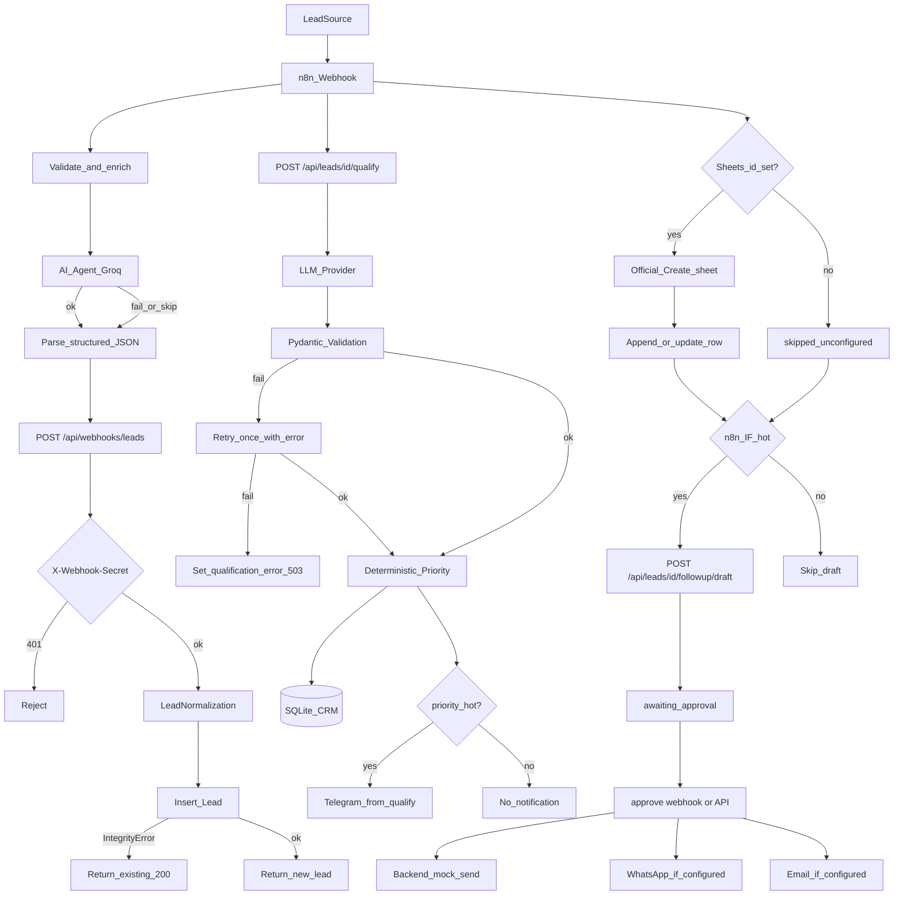

# Architecture

Portfolio implementation of an AI-assisted sales and CRM automation workflow. It is a demo, not a production CRM.

## Diagram



## Responsibilities

| Layer | Owns | Does not own |
|-------|------|----------------|
| n8n | Webhook intake, payload validation, local enrichment, official AI Agent pre-qualify, CRM HTTP orchestration, official Google Sheets upsert, official Telegram/WhatsApp adapters, HITL approve webhook | Deterministic CRM priority, SQLite persistence |
| FastAPI | Validation, CRM, priority, HITL flag, backend Telegram on qualify | Visual orchestration |
| LLM | Intent, industry, pain points, summary, draft text | Database writes, sending messages, arbitrary tools |
| SQLite | Lead records | Business rules |

## Notification paths

Hot-lead **CRM** Telegram is still triggered **inside** `POST /api/leads/{id}/qualify` after the backend computes `priority == hot` (unchanged backend).

n8n may send an **additional** sales-team Telegram alert only when `N8N_TELEGRAM_ALERTS=true` and Telegram credentials exist. Default is off so a local demo does not double-send or pretend a channel works.

Customer-facing WhatsApp and email run only on `POST /webhook/lead-approve` after a draft exists. Unconfigured adapters are skipped.

After a successful qualify, n8n upserts the lead into Google Sheets with the official **Create sheet** + **Append or update row** nodes when `GOOGLE_SHEETS_SPREADSHEET_ID` is set. Empty id skips with `channels.google_sheets = skipped_unconfigured`. FastAPI `POST /api/exports/google-sheets` can replace the worksheet with a full qualified-lead snapshot (service account) — CRM remains the source of truth.

n8n never auto-sends follow-up copy on intake. Hot IF still calls `POST /api/leads/{id}/followup/draft` only for the CRM draft.

## AI vs deterministic

**Deterministic**

- Payload validation and normalization
- Webhook shared-secret check
- Insert-first idempotency
- Priority thresholds
- CRM persistence and status transitions
- Human approval gate
- Mock send after approval

**AI**

- Industry / intent / product-fit classification
- Pain-point extraction
- Summary and recommended next action
- Follow-up draft text

## n8n orchestration vs backend qualification

n8n can call Groq to produce structured JSON **before** CRM writes. That output is validated in n8n and stored on the workflow response as `ai_prequalify`. The backend `/qualify` call remains the CRM source of truth for persisted priority.

If `GROQ_API_KEY` is absent, n8n skips the Groq node (`skipped_unconfigured`) and still persists + qualifies via the backend mock/Groq provider.

If backend `/qualify` returns 503, n8n takes the **Qualification Failed Review** path: the lead stays retryable, no draft, no customer send.

## Status state machine

Lead `status` allowed transitions:

```
new  --successful /qualify-->  qualified
qualified  --approve-followup or PATCH-->  contacted | lost
contacted  --PATCH-->  meeting | proposal | lost
meeting  --PATCH-->  proposal | lost
proposal  --PATCH-->  won | lost
won, lost  (terminal)
```

Rules:

- `new → qualified` happens only on a **successful** `/qualify`. PATCH cannot make that jump.
- Failed `/qualify` returns **503**, sets `qualification_error`, and **does not change** `status`. The lead stays retryable.
- Successful re-qualify of an already-qualified (or later) lead updates AI fields and priority but keeps the current `status`.
- Failed `/followup/draft` returns 503 and leaves `follow_up_status` unchanged.

Follow-up `follow_up_status`:

```
not_started → awaiting_approval → approved → sent
                              ↘ skipped (reject-followup or PATCH)
```

`draft_ready` is in the enum for completeness; the draft endpoint writes `awaiting_approval` directly.

Approve then mock-send happen in one explicit human call: `POST /api/leads/{id}/approve-followup`. Reject (`POST /api/leads/{id}/reject-followup`) keeps the draft for audit, sets `skipped`, and never sends. There is no automatic send.

## Providers

If `GROQ_API_KEY` is empty, qualification uses `MockLLMProvider` (keyword heuristics). That is **not** production inference.

If Telegram credentials are empty, notify is skipped and logged as disabled. Qualification still succeeds.
